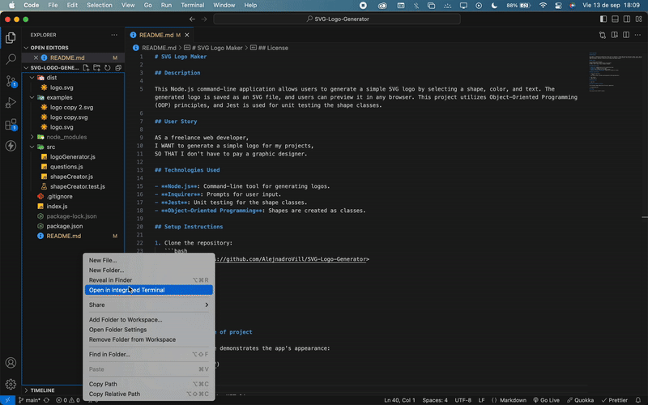

# SVG Logo Maker

## Description

This Node.js command-line application allows users to generate a simple SVG logo by selecting a shape, color, and text. The generated logo is saved as an SVG file, and users can preview it in any browser. This project utilizes Object-Oriented Programming (OOP) principles, and Jest is used for unit testing the shape classes.

## User Story

AS a freelance web developer,  
I WANT to generate a simple logo for my projects,  
SO THAT I don't have to pay a graphic designer.

## Technologies Used

- **Node.js**: Command-line tool for generating logos.
- **Inquirer**: Prompts for user input.
- **Jest**: Unit testing for the shape classes.
- **Object-Oriented Programming**: Shapes are created as classes.

## Setup Instructions

1. Clone the repository:
   ```bash
   git clone <https://github.com/AlejnadroVill/SVG-Logo-Generator>
   ```
2. npm install
3. node index.js

## Running Tests

1. npm test

## Visual reference of project

The following image demonstrates the app's appearance:



## License

This project uses the MIT license.
